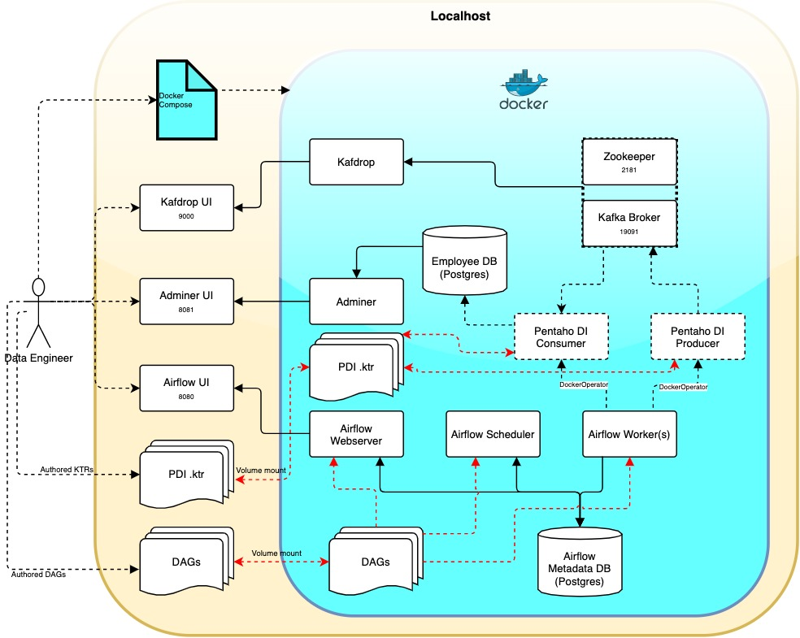

# Description

Airflow, Kafka and Postgres (target db) services spawned using _docker compose_. Airflow orchestrates the data pipeline,
including spawning of PDI containers (via _DockerOperator_). The
_producer.ktr_ file uses the built-in pentaho _Kafka Producer_ design component to publish messages to Kafka container. Whereas, the _consumer.ktr_ file runs a python script via a _CPython Script Executor_ plugin. Reasons for not using built-in PDI Kafka consumer:
1. Unable to stop the built-in PDI consumer in case of no messages. As a result the Airflow DAG stays in running state forever.
2. Needed a way to assign specific topic parition to the _consumer.ktr_ to work on.
3. Commit offsets only after they are successfully processed and inserted into database.
4. Added flexibility of Python for future customizations to the consumer.

# Architecture



**Process flow:**
- TWO pdi transformation _.ktr_ files have been used. One serving as the _producer_ and the other as _consumer_.
- The _producer_ file gets the input data, builds the _key-message_ pair and sends to Kafka topic.
- The _consumer_ transformation reads each message offset from the Kafka topic, processes them before loading into PostgresDb.
- Both the _producer_ and _consumer_ transformations triggerred from Airflow via _DockerOperator_.
- Source code files like KTRs and DAGs are rather mounted from host to docker. This removes the requirement of re-building the docker images in case of a code change.

# Pre-requisites
- [Docker Engine](https://docs.docker.com/engine/install/) version: 20.10.6+
- [Docker Compose](https://docs.docker.com/compose/install/) version 1.29.1+


# Installation
All the required steps for this demo have been set in the below .sh file. If required update the **SETUP PARAMETERS** section of the shell script. Navigate to the git folder and run the below 2 commands.

```bash setup.sh```

- Creates a .env file and sets all the environment variables required by the services in docker compose.
- Builds the required docker images.

NOTE: This shell script also creates _jdbc.properties_ file for PDI containers. User needs to add all necessary DB connection strings if required. It is recommended to add this file to .gitignore.

```docker-compose up -d```

# Docker commands

- Start all services: ```docker-compose up```
- Stop all services and remove containers: ```docker-compose down```
- List all the running containers: ```docker ps``` (add ```-a``` to include inactive/dandling containers as well)
- Get insided a running container: ```docker exec -it <container-name> bash```
- Get system level docker objects list: ```docker system df```
- For more specific commands, please check Reference section.
- Container logs: ```docker logs [CONTAINER NAME]```, e.g ```docker logs airflow-webserver```. Add ```-f``` to follow log.
- In order to increase no. of Airflow workers: ```docker-compose up --scale airflow-worker=3```, if ```3``` workers required. Note: more the number of workers more will be the pressure on system resources.

# Process Monitoring
- Airflow logs: click task on UI > Logs
- Kafdrop: topic messages, their offsets and consumer lags
- Docker: using the above Docker commands, one can monitor the containers. You can add 3rd party container monitoring services to docker compose file.
# Reference

- Docker commands:
    - [Offical site](https://docs.docker.com/engine/reference/commandline/docker/)
    - [Third pary site](https://www.tutorialkart.com/docker/docker-commands/)
- Apache Kafka:
    - [APIs](https://kafka-python.readthedocs.io/en/master/apidoc/modules.html)
- CPython Script Executor plugin
    - [Developer's blog](https://markahall.blogspot.com/2016/01/cpython-scripting-in-pentaho-data.html)
